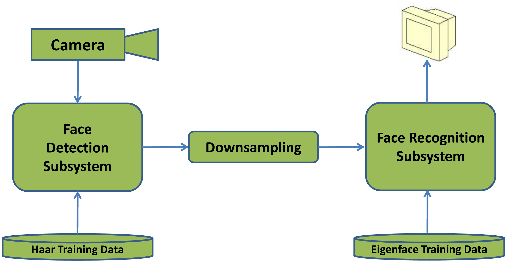
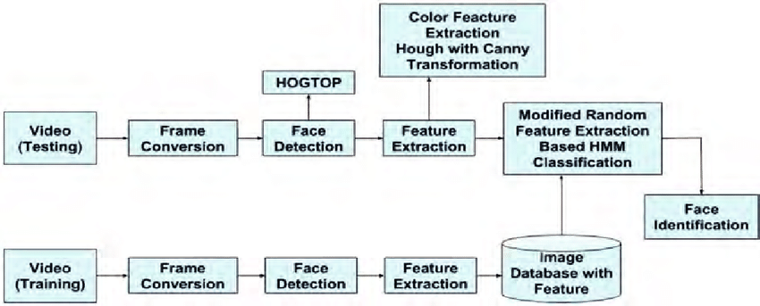
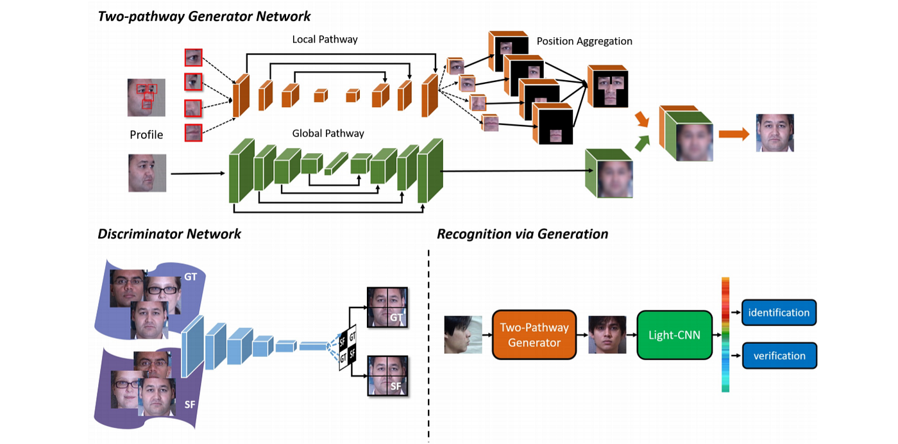

# Facial Recognition using Computer Vision 

This project implements a face recognition system leveraging the power of the face recognition library and OpenCV. It provides functionality for real-time face detection and recognition via a live webcam feed, comparing faces between static images, and utilizing encoded face data for efficient recognition. The system encodes images of known faces stored in a directory, allowing for seamless recognition during video capture. It is a simple yet effective demonstration of how computer vision and deep learning can be integrated to build practical applications.

This project demonstrates a face recognition system using the face_recognition library and OpenCV. The system can:

1. Detect and recognize faces from a live webcam feed.
2. Compare faces between two images.
3. Store and utilize encoded face data for efficient recognition.

## Architecture 

The architecture of this face recognition system is designed as a modular and sequential pipeline that integrates data acquisition, facial detection, deep learning based encoding, identity matching, and real-time visualization. The process begins with the image acquisition layer, where the system either loads stored images from the images/ directory or captures continuous video frames from a webcam. These inputs move into the preprocessing stage, where each frame is converted from OpenCV’s BGR format to RGB, ensuring compatibility with the face_recognition library. The next component is the face detection module, which uses dlib’s HOG-based detector to identify the locations of faces within the frame. Once detected, these face regions are passed to the encoding module, where a ResNet-based deep neural network transforms each face into a 128-dimensional embedding that numerically represents the person's facial features. These encodings are then compared to previously stored known encodings,loaded during initialization through the SimpleFacerec class using Euclidean distance to determine identity matches. The recognition module interprets these comparisons and assigns a name to each face, or labels it as unknown when no match is found. Finally, the processed results feed into the visualization layer, where bounding boxes and labels are drawn on the video frame and displayed in real time. Each component operates in a tightly connected pipeline, enabling the system to perform fast, efficient, and accurate face recognition while maintaining clarity, modularity, and scalability across all files and functions.

## Machine Leanring Models 
This face recognition system relies on the deep learning models provided through the face_recognition library, which is built on top of the dlib machine learning framework. These models collectively handle two essential tasks: locating faces within an image and generating numerical encodings that uniquely represent each detected face.

The project uses the HOG (Histogram of Oriented Gradients),  CNN (Convolutional Neural Network) models provided by the face_recognition library, which is built on top of dlib, for face detection and recognition.

### HOG Model 

The first model involved in the pipeline is the HOG-based face detector, which stands for Histogram of Oriented Gradients. This method extracts gradient patterns from an image and learns to identify the structural outlines of a human face, such as the nose, eyes, and jawline. HOG is efficient, lightweight, and CPU-friendly, making it ideal for real-time performance without requiring specialized hardware. It enables quick detection of face locations within a frame and works reliably for general-purpose applications like webcam-based recognition.

### CNN

In addition to HOG, the face_recognition library provides a more advanced CNN-based face detector. This model uses a deep convolutional neural network trained specifically for face detection, offering superior accuracy and robustness against variations in lighting, camera angles, and partially occluded faces. While CNN-based detection is more precise, it demands more computational power and performs best when supported by a GPU. For this reason, the project primarily uses the HOG detector, which provides the optimal balance between processing speed and accuracy for real-time applications. However, the system remains compatible with CNN detection for scenarios where accuracy takes priority over speed.

### RESNT'34

Once a face has been detected, the next major component of the model pipeline is the deep learning based face encoding network. The face_recognition library uses a powerful ResNet architecture, specifically a version of ResNet-34, to generate facial encodings. This network was trained on the well-known Labeled Faces in the Wild (LFW) dataset and learns to convert facial images into a compact 128-dimensional feature vector. Each vector acts as a highly discriminative signature of a person's face, capturing subtle structural and geometric features. These encodings are consistent enough to recognize the same person in different lighting conditions, angles, or expressions, yet distinct enough to differentiate between different individuals with high accuracy.

Face recognition in this project is achieved by comparing these encodings using Euclidean distance. When a new face is detected in a video frame or image, the system computes its encoding and measures how closely it matches stored encodings of known individuals. If the distance between two vectors is sufficiently small, the system identifies the person as a match. This combination of deep encoding and vector comparison allows the system to perform fast, accurate recognition in both static and live environments. The entire model workflow from HOG-based detection to ResNet-based encoding forms a robust and efficient pipeline, making this project a practical demonstration of how modern deep learning techniques enable real-time facial recognition on consumer hardware.

## Face Detection:

By default, the face_recognition library uses the HOG-based model, which is fast and efficient for CPU usage. Optionally, it can use a CNN-based model, which is more accurate but requires more computational power and typically a GPU.

## Face Encoding and Recognition:
It uses a deep learning-based ResNet model trained on the Labelled Faces in the Wild (LFW) dataset. This model generates 128-dimensional embeddings (encodings) for each face, which are then compared using distance metrics to identify or verify faces.

The ResNet model ensures robust performance in encoding faces and identifying matches based on their embeddings.

## Installation & Setup

To set up this project on your system, begin by installing Python (preferably version 3.8 or above) and ensuring that both OpenCV and the face_recognition library are properly configured. Since face_recognition depends on dlib, it is recommended to install the precompiled dlib wheel for your operating system to avoid compilation errors. After configuring your environment, install all required libraries using pip, including opencv-python, face_recognition, and numpy. Once the dependencies are installed, place your known face images inside the images/ folder, making sure each image is named after the person it represents. The project can then be executed directly by running video.py for real-time recognition or image_comparison.py for comparing two static images. A functional webcam is required for the live recognition module.

## How the Encoding Folder Works

The encoding process begins with the images stored inside the images/ folder. Each image should contain a clear frontal view of a single individual, and the filename (e.g., Ali.jpg) is automatically extracted and used as that person’s label during recognition. When the system runs, the SimpleFacerec class reads every file in this folder, converts the images to RGB format, and passes them through the ResNet encoding model to produce a 128-dimensional facial vector. These encodings are stored in memory along with their corresponding names, forming the project’s internal database of known identities. Any new image added to this folder is automatically included in future recognition sessions, making this approach extremely flexible and easy to update.

## Detailed Workflow

The project follows a structured and efficient workflow that begins with capturing input either from stored images or a live webcam feed. The incoming frame is preprocessed by converting it from BGR to RGB format, ensuring compatibility with the face_recognition library. Face detection is then performed using dlib’s HOG-based model, identifying the exact coordinates of every visible face in the frame. Each detected face is then passed through the deep neural network encoder, which converts the face into a unique 128-dimensional embedding. These embeddings are compared against the stored encodings from the images/ folder using Euclidean distance. The smallest distance determines the identity match, and the system labels the face accordingly or marks it as unknown if no match falls within the defined threshold. Finally, the video output is rendered with bounding boxes and name labels, completing the recognition cycle in real time.

## Limitations

Although effective and reliable, the system has several practical limitations due to the nature of real-time face recognition. Performance may degrade under poor lighting, extreme angles, or low-resolution video input, which can result in inaccurate face detection or mismatched identities. The HOG detector, while fast, is not as robust as advanced CNN-based detectors and may struggle with side profiles or partially obscured faces. Recognition accuracy also depends heavily on the quality and variety of the images stored in the encoding folder; using only one image per person may reduce robustness. Since all computations are executed on the CPU, performance may vary across devices, especially during high-resolution video processing. Additionally, the system does not include anti-spoofing mechanisms, meaning it may misinterpret printed photos or digital screens as real faces.

## Future Improvements

There are several opportunities to enhance the capabilities and performance of the system. Integrating CNN-based face detection would significantly improve accuracy under challenging conditions, while adding face tracking using algorithms like SORT or DeepSORT could create smoother real-time tracking. The system can also be extended to include an attendance logging feature, storing timestamps and identities in a database. Anti-spoofing modules, such as blink detection or depth analysis, could boost security in authentication scenarios. For larger datasets, storing encodings in a database or cloud service would make the system scalable and enterprise-ready. Finally, converting the pipeline into a web application or mobile app could expand usability across different platforms.

### Contribution 
I conceptualized and developed this project as a Semester Project of Computer Vision.

